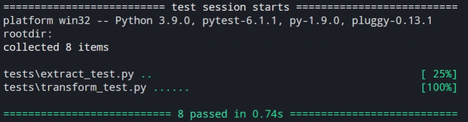

# Cafe-Connect 

### _Description_:  


The Cafe-Connect app is a solution-based application designed for Cafe's franchise managers located all around the UK. Unlike the
previous CSV back-up system, this serverless application allows managers to:  
1. Access real data from over 100 cafe locations;  
2. Identify local and regional customer trends;  
3. Use this information to make informed and impactful decisions.

<br/> 


### _Technologies & Architectures_:
* **Languages:** Python 3.8, Yaml<br/> 
* **SaaS:** Serverless<br/> 
* **Cloud Provider:** AWS<br/> 
   * **Storage:** Amazon S3
   * **Data Streaming** Amazon Kinesis
   * **Compute:** AWS Lambda 
   * **Integration** Amazon SQS
   * **Database** Amazon Redshift
   * **Analytics:** Amazon Quicksight

<br/> 
 

### _How it Works_:


The ETL process **(Extract, Transform, Load)** allows data to be gathered from multiple sources and consolidated into a
single, centralized location. Data has two sources: An S3 Bucket and a Kinesis Data Stream. A CloudWatch Event rule is used to automate the configured ETL process, so that the entire function is triggered daily. <br />
Python Package *boto3* is used to extract raw CSV data from an S3 bucket.<br /> 
The raw data is then transformed and cleaned, using Amazon Simple Queue Service (SQS) to integrate three separate Lamdas.<br />
The Python Package *psycopg2* is used to load this transformed data to a relational Redshift Database.<br />

>> Entire process starts at (time) daily, finishes at (time), taking a total of (time). Costs (£)

<br/> 


### _Tests_:


Comprehensive test suite for extract and transform modules runs in under a
second. Easy to run with `pytest` command:

```bash
$ cd team-1-project
$ pytest
```




<br/> 
<br/> 
<br/> 
<br/> 
